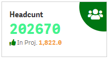
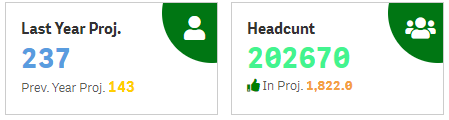

# kpi_5

Qlik Sense Basic Kpi visualization takes 2 measures, Font Awesome 5.1 supported

Measures : Min 2 Measures is needed

	-->Expression : can add expression

	-->Number formatting : basic  number formatting

	-->Header Label: label for the expression

	-->Font Size : accepts value in px/em

	-->Header Align : align the value to desired format

Navigation : 

	-->Select Sheet : select sheet to navigate

	-->Sheet Name : assign name

	-->Animation : animates the icon

Icon Coustomization : 

	-->Icon Background Color: apply color/expression based color

	-->Icon Color : apply icon color/expression based color

	-->Add Font : select Font, Supproted font's

				  ->Font Awesome 5.1 - https://fontawesome.com/changelog/latest

				  ->Leonardo ui fonts - https://webapps.qlik.com/leonardoui/index.html

